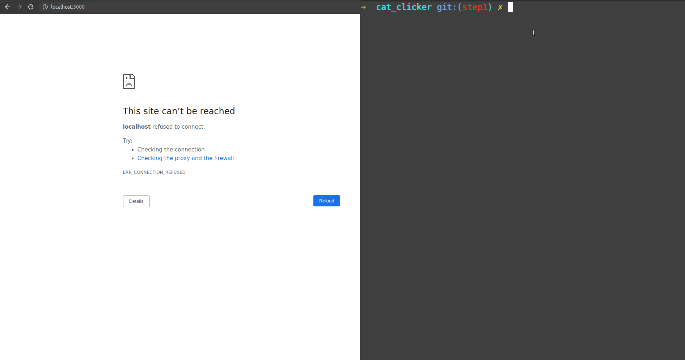
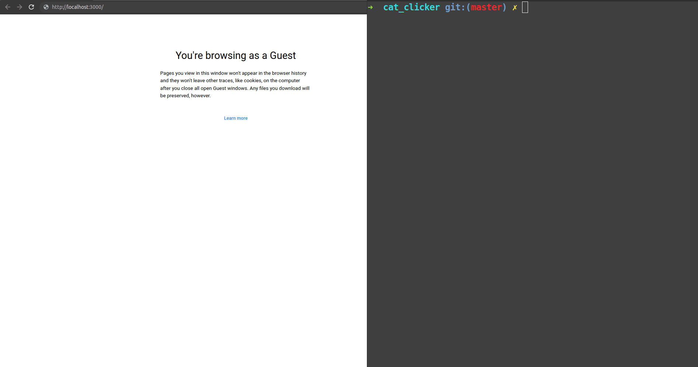

# cat_clicker

Is a Dockerized Vue app that is created in three steps. Each one of the steps is placed on its corresponding Git branch. The app is growing on functionality and complexity on each of the steps

## Step 1


## Step 2


## Step 3


## Example accessing to the second step
```shell
git checkout step2
```

## Start dockerized app
```
docker-compose up
```

## Open a browser and type localhost:3000

## Project setup
```
npm install
```

### Compiles and hot-reloads for development
```
npm run serve
```

### Compiles and minifies for production
```
npm run build
```

### Lints and fixes files
```
npm run lint
```

### Customize configuration
See [Configuration Reference](https://cli.vuejs.org/config/).
